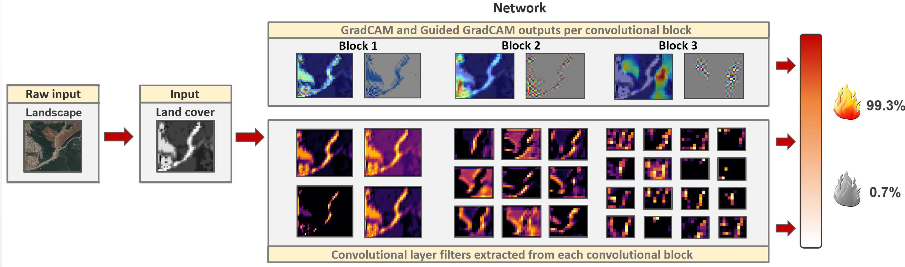
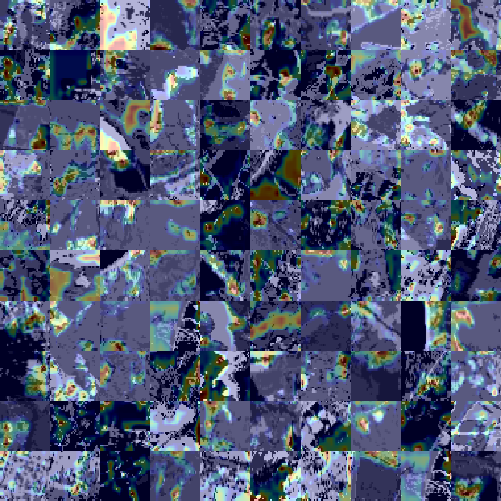
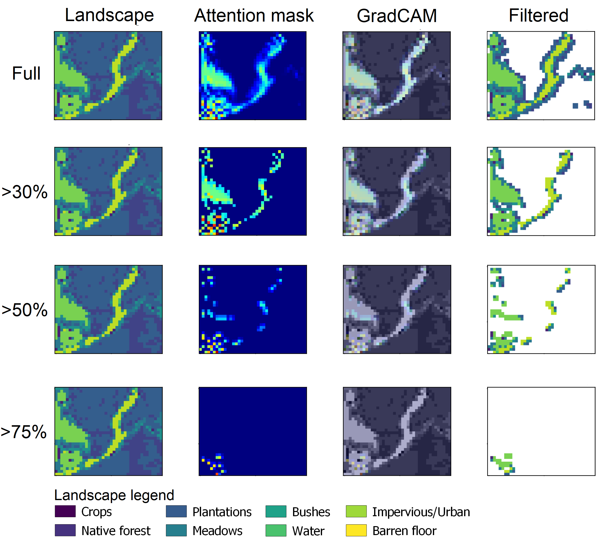

## Deep Fire Topology: Understanding the role of landscape spatial patterns in wildfire occurrence using artificial intelligence
### Cristobal Pais, Alejandro Miranda, Jaime Carrasco, Zuo-Jun Max Shen

## Disclaimer
This software is for research use only. 

## Introduction
Increasing wildfire activity across the globe has become an urgent issue with enormous ecological and social impacts. 
While there is evidence that landscape topology affects fire growth, no study has yet reported its potential influence on fire ignition. 
This study proposes a deep learning framework focused on understanding the impact of different landscape topologies on the ignition of a 
wildfire and the rationale behind these results. Our model achieves an accuracy of above 90% in fire occurrence prediction, detection, and 
classification of risky areas by only exploiting topological pattern information from 17,579 landscapes. This study reveals the strong potential 
of landscape topology in wildfire occurrence prediction and its implications for similar research. The proposed methodology can be applied to 
multiple fields/studies to understand and capture the role and impact of different topological features and their interactions.

## Documentation (WIP)

## Requirements
- Python 3.6+
- numpy
- pandas
- tensorflow
- matplotlib
- seaborn
- tqdm
- opencv
- imread
- imutils

## Installation and Usage
Execute directly from the notebooks/scripts. 
Requires a Google Earth Engine account to use the data_generator_gee scripts.

## Output examples
### Negative observations sample

### Positive observations sample

### Conceptual network architecture and outputs 

### GradCAM collage (100 landscapes)

### Zonal Statistics 

